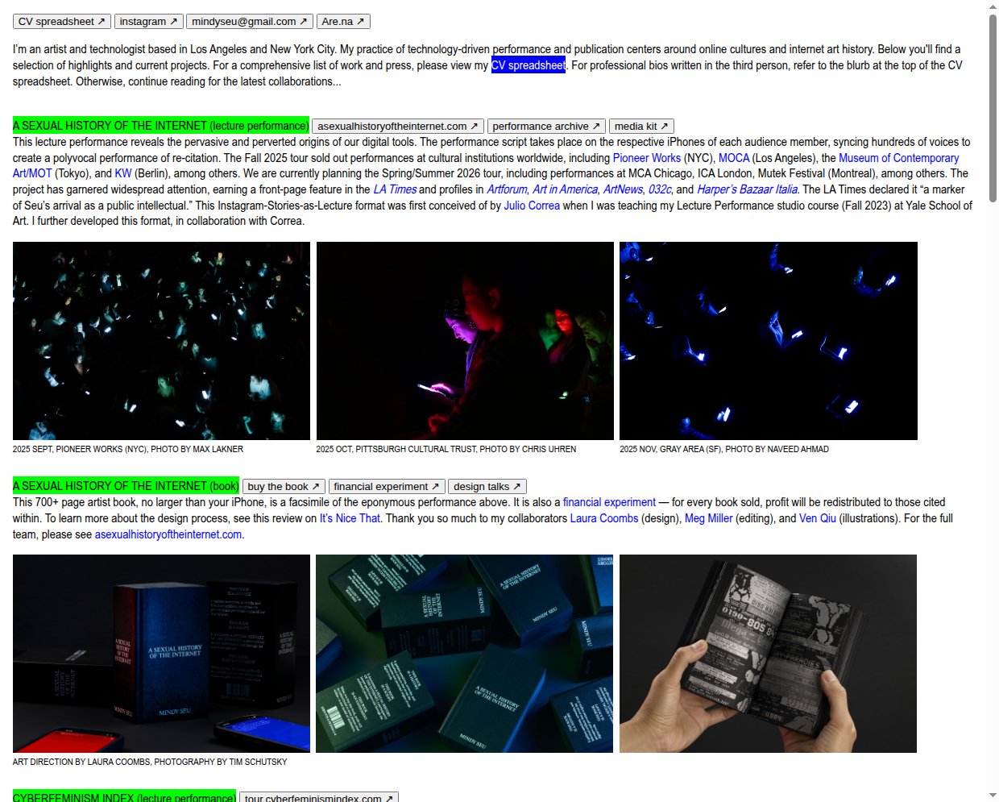
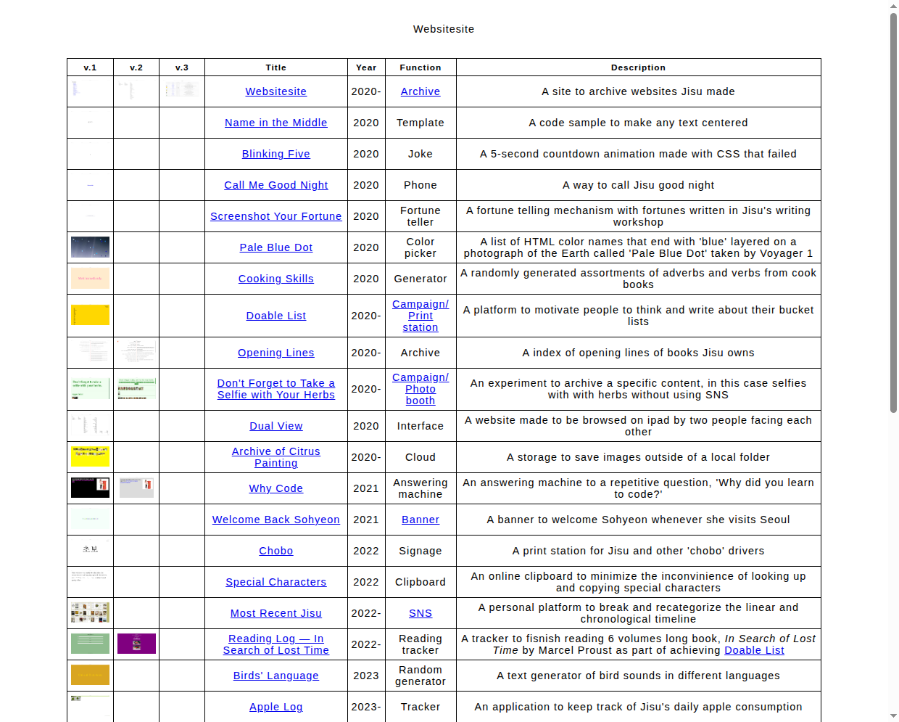

# DESIGN.md — visual direction

The design guide for Ori Olson's personal site. Agents doing any visual work read
this first, alongside `BRIEF.md` (purpose and principles) and `AGENTS.md` (rules).
Decisions recorded here override adjectives anywhere else.

## 1. Intention

In Ori's words:

> An evolving personal collection of work, experiments, and interests. Direct,
> curious, and visibly authored. Visitors should quickly understand who I am,
> then have room to wander.

## 2. References, annotated

Screenshots live in `design/references/`. Each annotation says what Ori likes,
why it works, and where it applies — so no agent has to guess whether the point
was the typography or the concept.

### Mindy Seu — mindyseu.com

- **What to carry:** direct introduction, work woven into personal context,
  compact typography, simple links, selective color accents.
- **Why it works:** the page reads like a person talking, not a portfolio
  presenting. Density signals substance; the restraint of plain links and few
  accents keeps attention on the words.
- **Where it applies:** the homepage introduction and the voice of project
  descriptions; typographic density and link treatment across the whole site.
- **Not the point:** her specific layout or content structure — borrow the
  directness, not the design.

### Laurel Schwulst — "My website is a shifting house next to a river of knowledge."

No screenshot — this reference is primarily a philosophy for the site, not a
visual model.

- **What to carry:** permission for the site to evolve, contain small things,
  and express Ori's interests.
- **Why it works:** it removes the pressure for completeness and polish that
  kills personal sites; a site that may shift is a site that gets tended.
- **Where it applies:** everywhere content and structure are decided — tiny
  pages are legitimate, sections may appear and disappear, imperfection is
  acceptable. It should temper any instinct to systematize too early.

### Websitesite — websitesite.xyz

- **What to carry:** scannable project index, descriptive labels, varied project
  types, discovery through browsing.
- **Why it works:** the table treats a joke and a serious tool identically, which
  makes browsing feel like rummaging through someone's actual practice; the
  "function" labels tell you what a thing *is* in two words.
- **Where it applies:** the project index page — its columns, its equal standing
  for experiments and professional work, and the pleasure of scanning it.
- **Not the point:** its minimal styling specifically — the index's honesty and
  scannability are the target.

### One Terabyte of Kilobyte Age — oneterabyteofkilobyteage.tumblr.com

[MISSING: screenshot — Tumblr rate-limited the capture. Retry later and save to
`design/references/one-terabyte.png`. The page is a vertical stream of full-width
Geocities homepage screenshots, each followed by its original URL, archive date,
and tags.]

- **What to carry:** an alternate visual stream where screenshots become entry
  points into projects.
- **Why it works:** images carry the browsing; metadata (URL, date, tags) sits
  quietly beside each one, so wandering is effortless and each image invites a
  click.
- **Where it applies:** the planned archive view only — an image-led way through
  the same `content/projects/` files, using each entry's `cover`. Not the primary
  interface.

## 3. Content principles

The writing carries a lot of the personality in this direction:

- Write in first person, using Ori's actual language.
- Give projects specific descriptions: what was made, what was interesting,
  what Ori contributed.
- Let the amount of content match the project. A tiny experiment can have a
  tiny page.
- Include process fragments when they reveal a decision or curiosity.
- Keep professional outcomes factual and easy to find.
- Leave space for personal interests without making every entry justify its
  career relevance.

## 4. Visual vocabulary

A few deliberate decisions that recur — not a component library. Chosen through
the working comparison below; the approved values get recorded here and become
the source of truth for `assets/style.css`.

| Decision | Direction A proposes | Direction B proposes | Approved |
| --- | --- | --- | --- |
| Typefaces, sizes, line spacing | Compact system sans, 15px base, 1.45 leading | Serif (Georgia), 19px base, 1.65 leading | [MISSING: Ori's choice] |
| Page margins and text widths | Wide working area, full-width index table | Narrow centered measure (~62ch), generous margins | [MISSING: Ori's choice] |
| Link, hover, focus treatments | Always-underlined electric blue; thick black focus outline | Always-underlined deep green, tinted background on hover; matching focus outline | [MISSING: Ori's choice] |
| Accent-color approach | Single electric blue (#0a45f0) for links and markers only | Single deep green (#1c5c3d) for links, hover tints, and small labels | [MISSING: Ori's choice] |
| Image proportions, captions, video | Flush-left media at text width, caption in smaller sans below | Media slightly wider than text, caption italic serif below | [MISSING: Ori's choice] |
| Mobile adaptation | Index table collapses to stacked label/value rows | Single column narrows, spacing compresses, list entries stack | [MISSING: Ori's choice] |

## 5. Review checklist

Ask of every design iteration — Ori and agents both:

- Can someone understand who Ori is and find a project quickly?
- Does the writing sound like Ori?
- Does the layout work with both a short experiment and a substantial project?
- Do type, spacing, and links create a clear hierarchy?
- Is there something specific to Ori's interests or work here?
- Does the mobile version retain the character?
- Which choices visibly connect to the annotated references?

## Working comparison — two directions, one page

One representative page (introduction + three projects: the real Pier Journal
draft plus two clearly marked placeholders), rendered in two visual directions.
Same content, same order, different vocabulary. Both are self-contained HTML
files — open them directly in a browser:

- `design/directions/a/index.html` — **Direction A, "Compact index":** dense,
  sans-serif, table-led; leans on Mindy Seu's density and Websitesite's
  scannability.
- `design/directions/b/index.html` — **Direction B, "Quiet room":** airy,
  serif, list-led; leans on Schwulst's calm and Mindy Seu's personal voice.

Screenshots of both directions at desktop and mobile widths accompany the pull
request for side-by-side comparison against the references.

After Ori compares them against the annotated references (use the checklist
above): record the chosen values in the "Approved" column of section 4, mark the
chosen file as the approved page here, apply the vocabulary to
`assets/style.css`, and update the pointer in `AGENTS.md`.

**Approved page:** [MISSING: Ori's choice — Direction A, Direction B, or a mix.]
